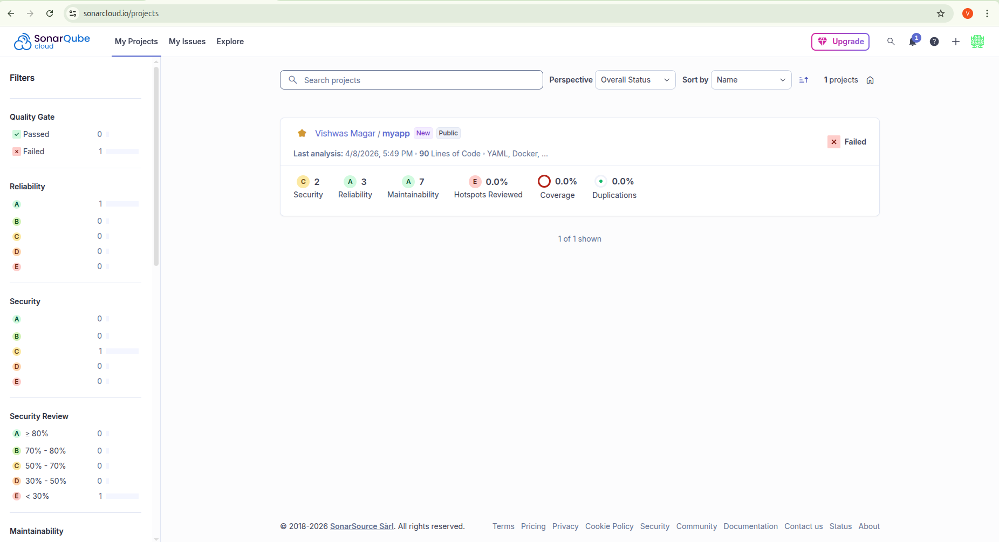
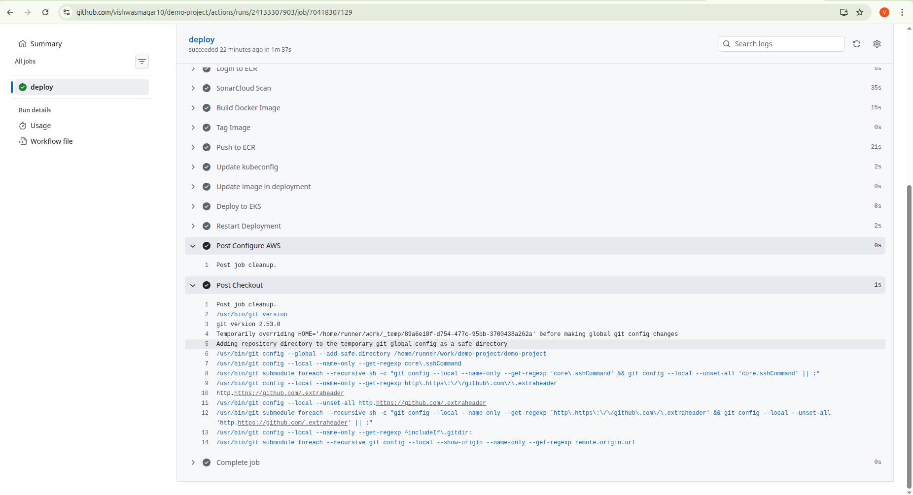

# 🚀 DevOps Demo Project with SonarCloud

## 📌 Overview

This project demonstrates integration of SonarCloud for automated code quality analysis in a CI/CD pipeline.

## 🛠️ Tech Stack

* GitHub
* SonarCloud
* (Add Jenkins / GitHub Actions if used)

## 🔄 CI/CD Flow

1. Code pushed to GitHub
2. Pipeline triggered
3. SonarCloud analysis runs
4. Quality Gate validation
5. Build passes/fails based on code quality

## 📊 SonarCloud Integration

* Code Quality Analysis
* Bugs & Vulnerability detection
* Maintainability checks

## 📸 Screenshots

### SonarCloud Dashboard

### Pipeline Execution

## 🔗 Project Links

* GitHub Repo: [your link]
* SonarCloud Dashboard: vishwasmagar10_demo-project

## 💡 Learning Outcome

* Learned how to integrate code quality checks in CI/CD
* Understood Quality Gates and code metrics
